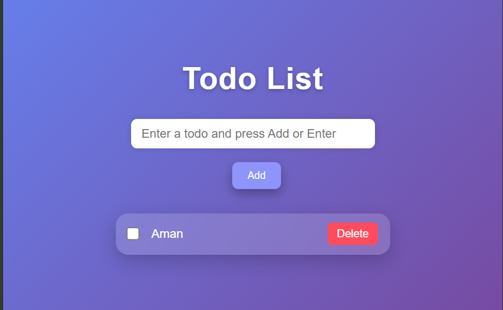

# Todo App – Task Management Web Application

Welcome to my Todo App project. This project showcases my frontend development skills using HTML, CSS, and JavaScript. It is a simple, responsive, and user-friendly application that helps users manage their daily tasks efficiently.

---

## Live Demo

🔗 https://codewithaman-dev.github.io/Todo-App/

---

## Project Details

This Todo App allows users to add, delete, and manage tasks with a clean and modern interface. The application uses Local Storage to save tasks, ensuring data persistence even after refreshing the browser.

This project demonstrates practical implementation of core frontend concepts such as DOM manipulation, event handling, and responsive design.

**Key highlights:**

* Add and delete tasks
* Store tasks using Local Storage
* Responsive design for all devices
* Clean and modern user interface
* Fast and lightweight performance

---

## Tech Stack Used

* HTML5
* CSS3
* JavaScript
* Local Storage
* Git & GitHub

---

## Features

* Fully Responsive Design
* Interactive User Interface
* Local Storage Support
* Simple and Clean Layout
* Beginner-friendly project structure

---

## Project Structure

```
Todo-App/
│
├── index.html
├── style.css
├── script.js
└── README.md
```

---

## Screenshots

### Preview


---

## GitHub Repository

https://github.com/codewithaman-dev/Todo-App

---

## Connect With Me

* LinkedIn: https://www.linkedin.com/in/aman-jangid-3b2796327
* GitHub: https://github.com/codewithaman-dev

---

## Show Your Support

If you like this project, please give it a ⭐ on GitHub!
